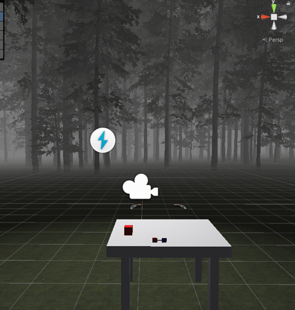
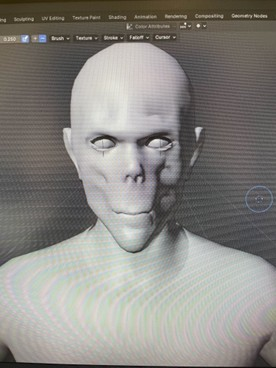
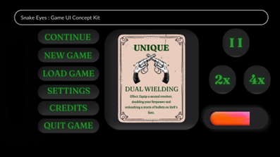

# Snake-Eyes Build #2

Previously we submitted our game design document for Snake-Eyes, the concept and vision for the game hasn’t changed since the first design document. We did decide to create some changes that simplify the game a little bit by deciding to focus on the revolvers as the main weapon and if there ends up being time, adding other weapons.

| Names | Eric P. | Rev G. | Nick B. | Brit G. |
| --- | --- | --- | --- | --- |
| Week 1 | Finalize holsters, work on making the upgrade interactables spawn new wavs | Implement rogue-like system | Continue work on models | UI design and creation |
| Week 2 | Finalize upgrade interactables, implement sound and music | Test roguelike system, ensure upgrades work as intended | Finalize enemy model, begin working on new model for revolvers | Finalize idea creation for UI design
| Week 3 | Create sound cues for whenever enemies get close to the player | Bugfix previous issues and quality of life updates | Work on models for new revolvers | Filling in and helping out other group members with ideas |
| Week 4 | Finalize and finish sound cues for enemies | Implementing UI elements into the game | Finish revolver work | Creating cover art for the game. |

## High Concept

The game concept and gameplay will stay the same from what it was designed to be from before. We have most of the game mechanics down and just need to finalize the gameplay mechanic programming and work on sound design.

## Platform

Will stay the same, it will be developed for PC

## Game World

The idea and design for the game world will stay the same, one of my goals will be to add a bit more to the environment and give an even more eerie feel to the game. An idea could be to change the amount of fog in some waves or change the lighting on some waves. Eventually the table will be removed from the scene.

## Gameplay Additions

Our goal is to completely finish the gameplay and begin adding to the empty void that is sound right now. Nick should be finalizing the models for the enemies and begin work on creating new

revolvers for the game that fit the style much better. Bullet counts will be added meaning the player can’t shoot infinitely and will need to use the reload mechanic in order to keep shooting.

Art for the models and UI for next build. We want to fully implement the rogue like system for the game meaning the player will be able to choose upgrades and have the enemy's health be incremented between waves creating a difficulty curve for the game.

